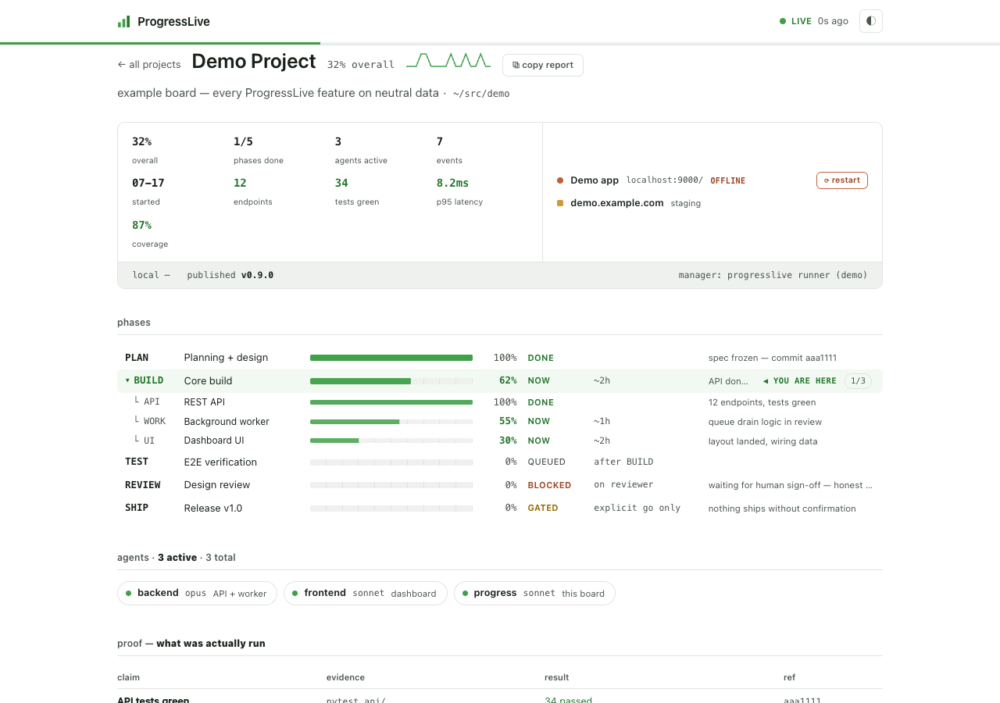
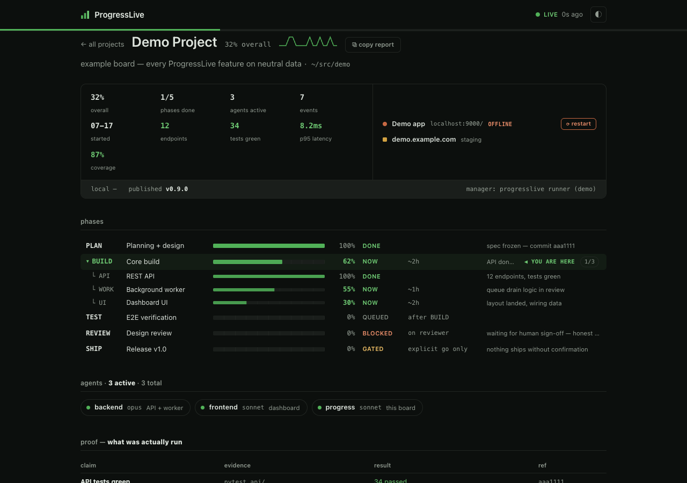

# ProgressLive 🟩

**Realtime dev-progress mission control.** Your agents write truth into file-backed
boards; you open one tab and see exactly where every project is — current state AND
full history — with a liveness badge that cannot lie.



Built 2026-07-17 by a resident tracker agent, live-tracking the build that created it
(and itself — the platform tracks its own board). Founding vision preserved verbatim
in [VISION.md](VISION.md).

## Why

- **Honest by construction** — the LIVE/IDLE/STALE badge derives from data age
  client-side; stale data can never look fresh. Proof tables record what was *actually
  run*, with refs. Agents are instructed: never invent progress.
- **Current + historical, always both** — `board.json` (atomic rewrite) is now;
  `events.jsonl` (append-only) is how you got here.
- **Zero everything** — no build step, no framework, no external requests, no deps
  beyond Python stdlib. One file serves, one file renders.

## Quickstart

```bash
git clone https://github.com/fire17/progresslive && cd progresslive
python3 progress.py serve --port 8177
open http://localhost:8177/#/demo        # bundled demo board
```

Register your project + drive it:

```bash
python3 progress.py init myapp --name "My App" --repo ~/src/myapp
python3 progress.py update myapp --phase BUILD --pct 40 --status now --eta "~2h" --here
python3 progress.py update myapp --phase BUILD --sub API --pct 100 --status done   # nested; phase % rolls up
python3 progress.py event  myapp "perf gate PASS — p95 8.2ms" --kind milestone --delta "commit abc123"
python3 progress.py roster myapp --set backend:opus:"API + worker":building
python3 progress.py proof  myapp --claim "tests green" --cmd "pytest" --result "34 passed" --ref abc123
python3 progress.py setjson myapp kpis '[{"label":"tests green","value":"34"}]'
python3 progress.py board  myapp        # ANSI board in your terminal
```

## What you get

| Surface | |
|---|---|
| **Fleet view** `#/` | every project: live bar, current phase, unread chips, activity sparkline, liveness dot |
| **Project board** `#/<slug>` | phases w/ bars + one ◀ YOU ARE HERE + expand/collapse subitems, agent roster, proof table, filterable event feed |
| **Control strip** | KPIs (generic + per-project), local ports w/ live TCP probes + restart buttons, published links, live `git describe` version |
| **Instant everything** | rich tooltips, copy-board-as-ASCII-report, new-since-last-visit markers, keyboard nav (`g` `1-9` `t` `/`), dynamic favicon, dual OKLCH themes |

Realtime: clients poll `/api/state` every 1.5s with ETags (idle = 304, 0 bytes); a board
write reaches open tabs in ~0.5–1s with no reload — even layout changes self-deploy
(`site_v` reload). Measured, not claimed: see [BUDGETS.md](BUDGETS.md).



## Agents: skills + MCP

```bash
./install.sh    # installs /progresslive (/plv), /progresslive-runner (/plr), /dev-progress (/dvp)
```

- **`/progresslive`** in any Claude Code session spawns a resident tracker subagent
  (model from `runner.config.json` — default sonnet, never the orchestrator model) that
  registers the project, seeds the board from real git history, serves, opens, and keeps
  it truthful: polls git + tasks, mirrors parent deltas within seconds, asks the parent
  for phase sub-structure (never invents), and boards every scope-add immediately.
- **MCP** — any harness writes boards through 6 tools; 3 more (`pl_detect`/`pl_ensure`/
  `pl_runner_brief`) + server instructions make tracking automatic for every project:
  ```bash
  claude mcp add --scope user progresslive -- python3 $(pwd)/mcp_server.py
  ```

## Data contract (schema 1 — the interface is files, not this code)

```
projects/<slug>/board.json     current state (atomic temp+rename)
projects/<slug>/events.jsonl   history (append-only, never rewritten)
```

`phases[{key,label,pct,status,eta,note,subitems[]?}]` · `status ∈ done|now|queued|blocked|gated`
· one `here` · `roster[]` · `proof[]` · `kpis[]` · `links{local[],published[]}` · `version{}`.
Anything that writes these shapes is a first-class citizen — CLI, MCP, cron, another
harness. New project = new directory; the fleet view picks it up with zero code changes.

## Roadmap

[REMOTE.md](REMOTE.md) — view boards from any computer via a static Pages shell, with
your local machine as the only backend: tunnel + revocable token auth + SSE push. No
project data leaves the machine unauthorized, by design.

## Design

A mastering suite's meter bridge, not a SaaS dashboard: white bench + plotter-green ink,
real dark theme, OKLCH tokens, system fonts, rows not cards. Rationale: [PRODUCT.md](PRODUCT.md).

## License

MIT © [fire17](https://github.com/fire17)
